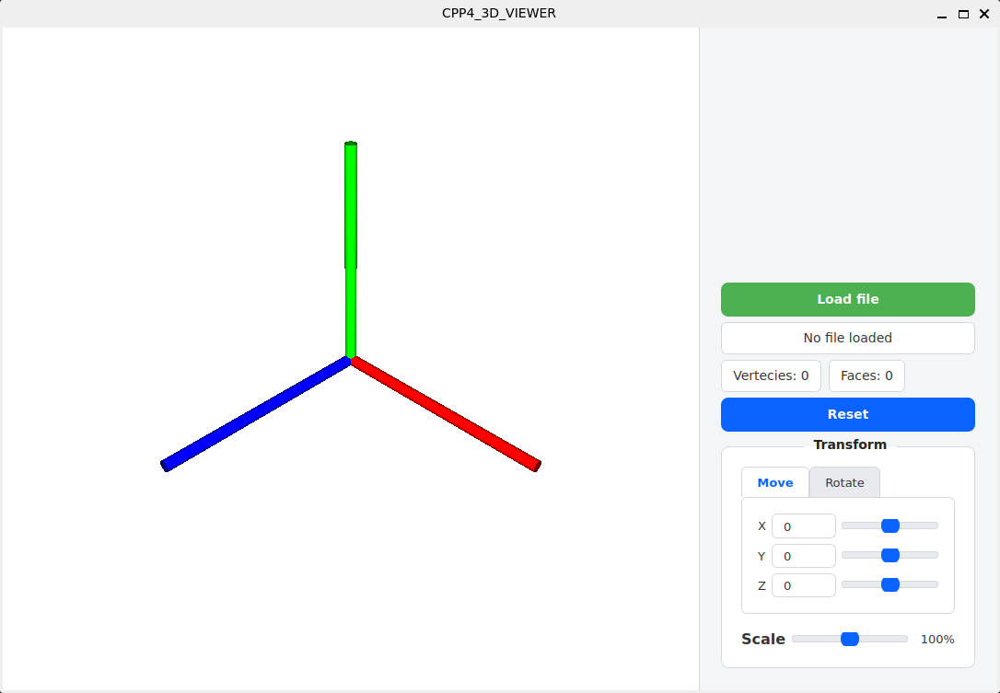
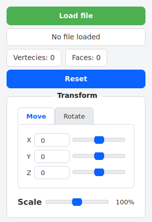
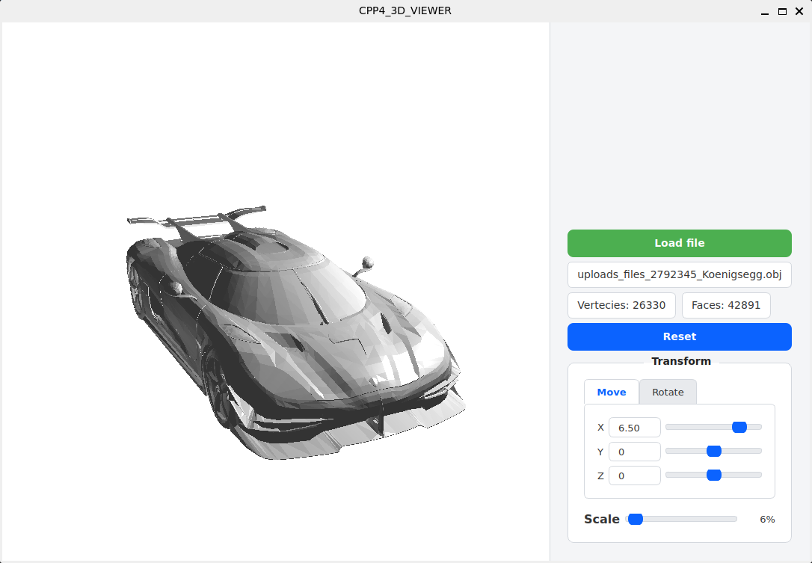

markdown

# 3DViewer v2.0

## Введение

3DViewer v2.0 — это программа для просмотра и работы с 3D-моделями, разработанная на C++ с использованием библиотеки Qt. Приложение поддерживает загрузку моделей в формате OBJ, предоставляет инструменты для манипуляции объектами в пространстве и включает различные визуальные настройки.





## Основные функции

### 🎯 Загрузка и отображение моделей
- **Поддержка формата OBJ** файлов
- **Отображение информации** о модели (количество вершин, полигонов)
- **Центрирование и автоматическое масштабирование** модели при загрузке

### 🎮 Манипуляции с объектом
- **Перемещение**: вдоль осей X, Y, Z
- **Вращение**: вокруг осей X, Y, Z  
- **Масштабирование**: равномерное и по осям

### ⚙️ Настройки отображения
- **Режимы проекции**: параллельная и центральная
- **Типы ребер**: сплошные/пунктирные, настройка цвета и толщины
- **Типы вершин**: круг/квадрат/отсутствуют, настройка цвета и размера
- **Цвет фона**: настраиваемый

### 💫 Дополнительные возможности
- **Сохранение скриншотов** в форматах BMP и JPEG
- **Запись анимаций (GIF)** вращения модели
- **Поддержка темной и светлой темы** интерфейса

## Управление

### 🖱️ Мышь
- **ЛКМ + перемещение**: вращение модели
- **ПКМ + перемещение**: перемещение модели
- **Колесико**: масштабирование

## Установка

1. **Клонируйте репозиторий**
2. **Перейдите в директорию `src/`**
3. **Создайте папку для сборки:**
   ```bash
   mkdir build && cd build

4. **Соберите проект:**
   ```bash
    cmake .. && make

5. **Запустите приложение:**
    ```bash
    ./3DViewer

## Тестирование

**Проект включает unit-тесты для математической библиотеки, обеспечивающие покрытие кода не менее 80%. Для запуска тестов:**
    ```bash
    make test

## Архитектура

**Программа использует паттерн MVC для разделения логики отображения и данных.**

Разработано с использованием C++ и Qt Framework